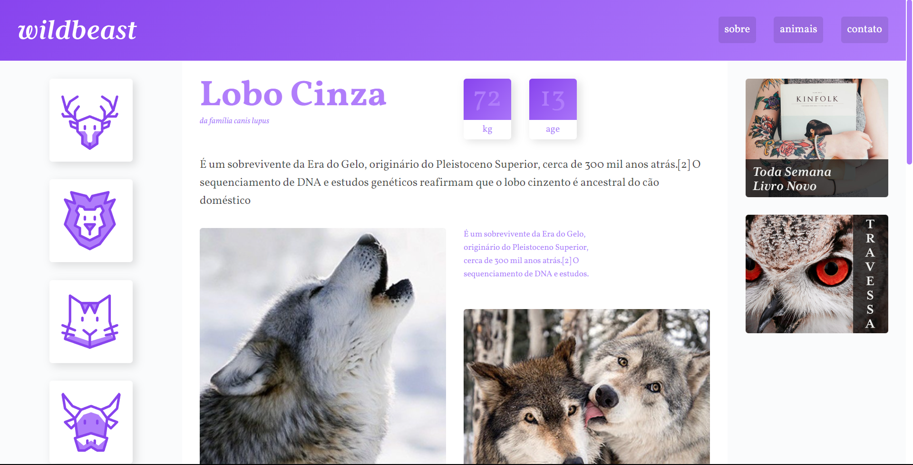

# Wildbeast
<div align="center">

</div>

## Descrição
Este repositório abriga o código-fonte do site Wildbeast, um emocionante projeto desenvolvido utilizando HTML e CSS. Explore o mundo dos animais enquanto mergulha na magia do design responsivo e da organização eficiente do CSS Grid.

O Wildbeast é um site único que oferece informações fascinantes sobre diversos animais fantásticos. Com uma abordagem visualmente envolvente e interativa, este projeto é um exemplo impressionante de como o HTML e o CSS podem ser combinados para criar uma experiência online cativante.

## Status do projeto
Projeto concluído.

## Pré-requisitos

- HTML5;
- CSS.

## Instalando

1. Clone o repositório para o seu ambiente local:

```
$ git clone https://github.com/igoraugustobrz/Wildbeast
```

2. Navegue até o diretório do projeto.

```
$ cd Wildbeast
```

## Contribuindo

Contribuições são bem-vindas! Se você quiser contribuir para o projeto, siga as etapas abaixo:

1. Fork o repositório e clone-o para o seu ambiente local.

2. Crie uma nova branch:

```
git checkout -b minha-contribuicao
```

3. Faça as alterações desejadas e commit-as:

```
git commit -m "Minha contribuição"
```

4. Envie suas alterações para o repositório remoto:

```
git push origin minha-contribuicao
```

5. Abra uma solicitação de pull no repositório original.

## Autor

- Igor Augusto
- E-mail: igoraugustobz@gmail.com
- Conecte-se comigo no [LinkedIn](https://www.linkedin.com/in/igorbrz/).